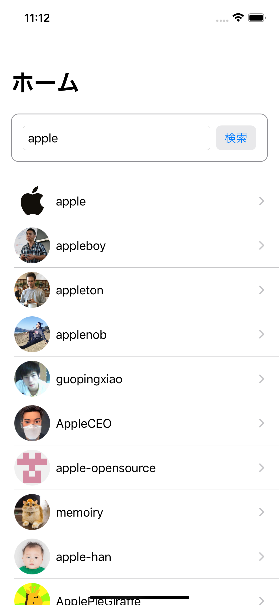
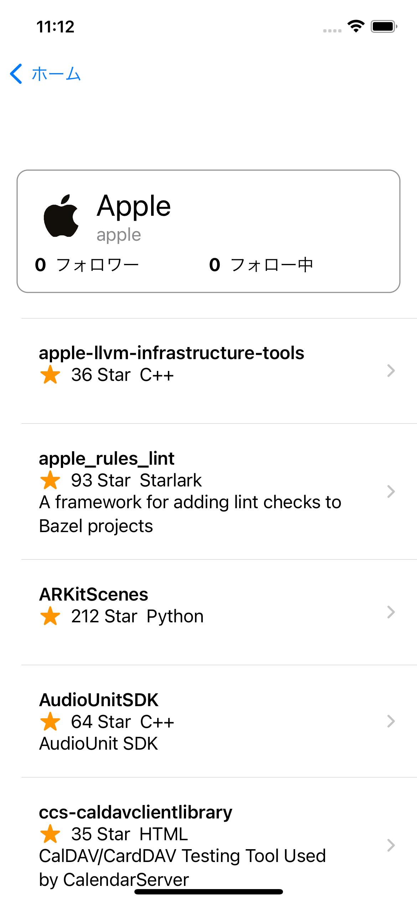

# GitHub User Search

- GitHubのユーザーを閲覧できるクライアントアプリです

| 検索画面 | 詳細画面 | ブラウザ |
| ------- | -------- | ------ |
|  |  |  |

# 機能

##  ユーザー一覧画面

- ユーザーの一覧をリストで表示する
    - アイコン画像
    - ユーザー名
- ユーザーを選択するとユーザーリポジトリ画面に遷移する

## ユーザーリポジトリ画面

- 画面の上部にユーザーの詳細情報を表示する
    - アイコン画像
    - ユーザー名
    - フルネーム
    - フォロワー数
    - フォロイー数

- 画面下部にはユーザーのリポジトリを一覧表示する（ただしforkedリポジトリは除く）
    - リポジトリ名
    - 開発言語
    -  スター数
    - 説明文

- リポジトリ一覧の行をタップするとWebViewでリポジトリのウェブサイトを表示する

# 開発環境

- Xcode 13.2.1
- macOS 11.6

# アプリの動作環境

- iOS 15.0+

# 実装上の工夫

- `SwiftUI` を採用した
- `View` は `Preview` が可能なようにコンポーネント単位で分割するようにした
- `MVVM` を意識して実装を分割した（正しく実装できているか自信はない）
- APIを叩いてデータを取得する処理は `Combine` を使って実装した

# 認証

- API認証に`Personal Access Token`を使用する場合は以下の変数にセットしてください


```
private let GITHUB_PAT = ""
```

https://github.com/yorifuji/GitHubUserSearch/blob/main/GitHubUserSearch/Model/GitHubAPI.swift#L11